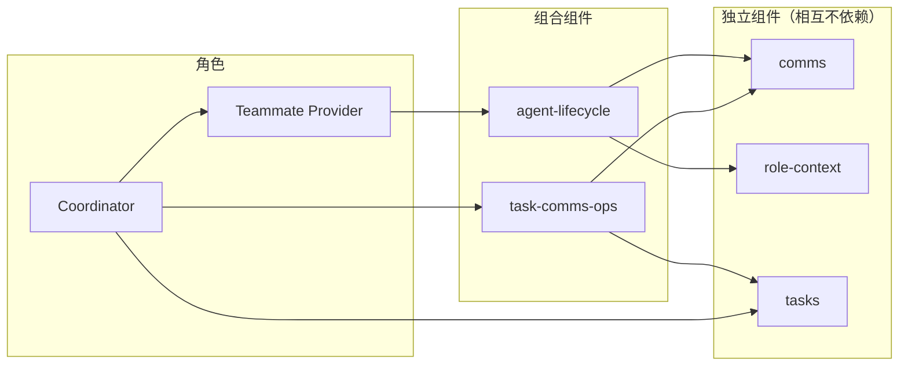

# 总述与文档目录

Pi Agent Team DAG 是运行在 Pi Coding Agent 之上的多 agent 协作系统：同一台机器（或同一网络）上的多个 agent 通过 **comms** 通信，通过 **task 图**共享目标与进度，通过 **Teammate Provider** 按需找到或创建队友，由管理节点（Coordinator）驱动「分解 → 派发 → 验证 → 调整 → 同步」闭环推进到完成。

---

## 1. 总体架构

三个**独立组件**（相互不依赖）：

- **comms** — 通信网络层：NATS + JetStream 上的 agent 发现、消息传递、回复应答、定时提醒（docs/1）
- **role-context** — 角色模板与上下文：`--role` flag、角色模板注入、LLMContext 构建（docs/2）
- **tasks** — 任务图数据系统：图存储 + `task_*` 工具，进度权威源（docs/6）

建立在独立组件之上的**组合组件**：

- **agent-lifecycle** — Agent 生命周期管理：tmux 里的 spawn / kill、auto-exit，建立在 comms（hub 连接与消息）和 role-context（角色模板、上下文构建）之上（docs/3）
- **task-comms-ops** — 基于 comms 的任务图协调操作：把「找 agent → 派发委派 → 记录到图 → 通知」等复合协调动作封装为单个工具（含 worker 侧的开工声明 `task_start` 与完成回复 `task_submit_report`，工具见 docs/5 §3），建立在 comms（identity + messaging）和 tasks（store + graph）之上；并自动跟踪 comms profile 的 `current_task`（开工设标题、汇报清空，comms 据此驱动 session 名 `cname [当前任务]`，手动命名优先，见 docs/1 §6.6）

建立在组合组件之上的**角色**：

- **Teammate Provider** — 网络 Agent 注册中心，建立在 agent-lifecycle 之上（docs/4）
- **Coordinator** — 管理角色，拥有被交给的节点及其子图（顶层 = 被用户委托，无「根节点」特殊概念），建立在 teammate-provider 与 task-comms-ops 之上（docs/5）

**依赖关系**（A → B：A 建立在 B 之上）：

---

## 2. 文档目录

| 文档 | 内容 |
|------|------|
| [1-comms.md](1-comms.md) | comms 的设计与功能：NATS 拓扑、注册、消息、回复、提醒 |
| [2-role-context.md](2-role-context.md) | role-context：角色模板格式、LLMContext 构建、session 创建/fork、`--role` 注入 |
| [3-create-and-kill-agent-on-net.md](3-create-and-kill-agent-on-net.md) | agent-lifecycle：spawn / kill、auto-exit |
| [4-teammate-provider.md](4-teammate-provider.md) | Teammate Provider：唯一注册中心、匹配 vs spawn、回复 agent 名 |
| [5-coordinator.md](5-coordinator.md) | Coordinator 管理角色：图驱动闭环、需求明确入口、递归、接口仲裁 |
| [6-task-graph.md](6-task-graph.md) | task 图数据系统：核心模型、存储、工具、推进语义 |

---

## 3. 概念速览

- **task 是图上唯一的实体**（docs/6）——目标、子目标、执行单元都是它；计划=图。
- **执行推进**：标记叶子 done → 系统解锁后继（unlocked）→ 从就绪集继续派发。
- **管理节点建立在 task 之上**：维护图、从就绪集并行派发、验证后标记 done。
- **变更通知**：comms 的 fire-and-forget 消息（`comms_send(..., remind_ms=0)`），公告体指向 `task_read`。

---

## 4. 组件装配与协作

- **spawn 统一装配**：spawn 出的 agent 由 launch script 统一加载 comms + role-context + auto-exit（docs/3 §7.1），自动注册 comms、自带角色模板；交互式启动的 agent 加载组合扩展目录即可——`extensions/agent-lifecycle`、`extensions/teammate-provider` 等入口的 `package.json` `pi.extensions` 清单声明其低层依赖并按顺序自动加载，不需要手写依赖清单（docs/2 §5）
- **跨组件调用不走工具层**：TP 经模块导入直接调用 agent-lifecycle 的 `executeAgentSpawnByRole`（docs/3 §8.2）；task-comms-ops 在代码内部组合 comms 与 tasks 能力
- **角色工具构成**：Coordinator = task-comms-ops 高级工具 + tasks 只读工具 + comms 工具（docs/5 §3）；各 specialist 在 spawn 时经 launch script 获得 tasks 图工具与 comms 工具
